# Building My First AI Agent with LangGraph
## Learning Notes & Team Reference

> **What is this?** My notes from learning how to build a stateful AI agent using LangGraph. This documents what I built, what I learned, and what's next.

**Author**: Learning Journey  
**Last Updated**: January 28, 2026  
**Status**: Working prototype, learning in progress

---

## What I Built

A **Knowledge Ownership Agent** that answers questions about code ownership in our repository.

**It can answer**:
- "Who owns the payment module?"
- "What's our bus factor?"
- "Show me risky modules"

**Live demo**: http://localhost:3000 (when running)

---

## Why LangGraph?

### The Problem I Was Trying to Solve

Traditional chatbots just send messages back and forth. I needed an agent that could:
1. Check if a question is valid (guardrails)
2. Figure out what the user wants (intent)
3. Plan which tools to use
4. Execute tools
5. Check if it has enough info
6. Generate a response

That's too complex for a simple loop!

### Why Not Just Use LangChain?

LangChain is great for simple chains, but **I needed loops and decisions**:
- Sometimes the agent needs to call multiple tools
- Sometimes it needs to go back and get more data
- I need to SEE what's happening at each step (for debugging)

**LangGraph lets me draw the flow as a graph** → easier to understand and debug.

---

## How It Works

### The 7-Node Graph

```mermaid
graph TB
    START([User Query]) --> orch[1. Orchestrator<br/>Set up context]
    orch --> guard[2. Guardrail<br/>Is this allowed?]
    
    guard -->|❌ Blocked| END([END])
    guard -->|✅ Allowed| intent[3. Intent Parser<br/>What does user want?]
    
    intent --> plan[4. Query Planner<br/>Which tools to use?]
    plan --> exec[5. Tool Executor<br/>Run the tools]
    exec --> refl[6. Reflector<br/>Do we have enough data?]
    
    refl -->|Need more| plan
    refl -->|Enough| resp[7. Response Generator<br/>Create answer]
    resp --> END
```



### What Each Node Does

| Node | Job | Example |
|------|-----|---------|
| **Orchestrator** | Sets up the session | "You are a Knowledge Ownership Agent" |
| **Guardrail** | Blocks off-topic queries | ❌ "What's the weather?" → BLOCK |
| **Intent Parser** | Figures out what user wants | "Who owns auth?" → `module_ownership` intent |
| **Query Planner** | Decides which tools to call | Need: `get_module_ownership` tool |
| **Tool Executor** | Runs the tools | Calls tool → gets owners list |
| **Reflector** | Checks if we have enough info | "Do I have ownership data? Yes!" |
| **Response Generator** | Writes the final answer | "Alice owns 85% of the auth module..." |

---

## Key Concepts I Learned

### 1. State Management with Reducers

**Problem**: When nodes update state, what happens to old data?

**Default**: New data overwrites old data ❌
```typescript
// Messages get overwritten!
state = { messages: [old message] }
state = { messages: [new message] } // Lost old message!
```

**Solution**: Use **reducers** to control how data merges
```typescript
const AgentState = Annotation.Root({
  // Append messages (don't overwrite)
  messages: Annotation<BaseMessage[]>({
    reducer: (x, y) => x.concat(y), // Merge arrays
  }),
  
  // Merge tool results
  toolResults: Annotation<Record<string, unknown>>({
    reducer: (current, next) => ({ ...current, ...next }), // Merge objects
  }),
});
```

**Key takeaway**: Think about how each field should update - append, merge, or replace?

---

### 2. Conversation Memory with MySQL

**Problem**: How does the agent remember previous messages?

**Solution**: LangGraph **checkpointer** saves state to database after each node.

```typescript
// Save state to MySQL
import { MySQLSaver } from "./mysql-saver";

const checkpointer = new MySQLSaver();
const graph = workflow.compile({ checkpointer });

// Each conversation has a thread_id
await graph.invoke(input, { 
  configurable: { thread_id: "user-123" } 
});
```

**What happens**:
1. User asks: "What's the bus factor?"
2. Agent responds with answer
3. State saved to database ✅
4. User follows up: "Show me risky modules"
5. Agent loads previous state from database
6. Agent knows context from previous question!

---

### 3. Prompts as YAML Files

Instead of hardcoding prompts in code, I store them as YAML files:

**Why?**
- Easy to edit without touching code
- Version control shows prompt changes
- Can A/B test different prompts easily

**Example** (`prompts/guardrail.yaml`):
```yaml
template: |
  # CONTEXT
  You are a STRICT Guardrail for a Knowledge Ownership Agent.
  
  # OBJECTIVE
  Block any query outside software engineering topics.
  
  # RESPONSE FORMAT
  JSON: {"allowed": boolean, "reason": string}
  
  # INPUT
  Query: "${userQuery}"
```

**In code**:
```typescript
const prompt = await loadPrompt("guardrail.yaml");
const response = await llm.invoke(prompt);
```

---

### 4. Preventing Infinite Loops

**Problem**: Agent might loop forever!
```
Plan → Execute → Reflect ("need more data") → Plan → Execute → ...
```

**Solution**: Hard limit on iterations
```typescript
function reflectorNode(state) {
  // CRITICAL: Force stop after 5 iterations
  if (state.iterations >= 5) {
    return "response_generator"; // Exit loop
  }
  
  if (hasEnoughData(state.toolResults)) {
    return "response_generator";
  }
  
  return "query_planner"; // Continue
}
```

**Lesson**: Never trust LLM to decide when to stop. Always have a hard limit.

---

## What I Built: File Structure

```
minimal-agent-demo/
├── src/
│   ├── agent/
│   │   ├── graph.ts           ← Main graph definition
│   │   ├── state.ts           ← State schema with reducers
│   │   └── nodes/             ← Each node (7 files)
│   │       ├── orchestrator.ts
│   │       ├── guardrail.ts
│   │       ├── intent-parser.ts
│   │       ├── query-planner.ts
│   │       ├── tool-executor.ts
│   │       ├── reflector.ts
│   │       └── response-generator.ts
│   ├── tools/                 ← 5 mock tools
│   ├── prompts/               ← 6 YAML prompt files
│   └── mysql-saver.ts         ← Database checkpointer
├── app/                       ← Next.js UI
└── database/
    └── schema.sql             ← Database tables
```

---

## Testing Results

I tested the agent with 12 scenarios:

### ✅ What Works
1. Greetings: "hi" → Professional introduction
2. Module queries: "Who owns payment?" → Returns ownership data
3. List queries: "List all modules" → Returns 3 modules
4. Guardrails: "What's the weather?" → Correctly blocked
5. Guardrails: "Tell me a joke" → Correctly blocked
6. Multi-turn: "What's bus factor?" → "Show me risky modules" → Context maintained!
7. Long inputs (300+ chars) → Handled gracefully
8. Special characters: `<>`, `&`, `{}` → Works fine

### 📊 Test Results
- **12/12 tests passed** ✅
- Guardrails working
- Memory persisting across turns
- UI shows agent thought process

**See**: [`walkthrough.md`](file:///home/ces-user/.gemini/antigravity/brain/b89b32fa-020e-4468-8e2a-959fd83e91a0/walkthrough.md) for detailed test screenshots

---

## What I Learned (Mistakes I Made)

### 1. Forgot Reducers Initially
❌ **Mistake**: Didn't configure reducers  
💥 **Result**: State kept getting overwritten, lost conversation history  
✅ **Fix**: Added custom reducers to all state fields

### 2. Infinite Loops
❌ **Mistake**: Let LLM decide when to stop  
💥 **Result**: Agent looped forever, cost $10 in API calls  
✅ **Fix**: Added `max_iterations = 5` hard limit

### 3. JSON Parsing Errors
❌ **Mistake**: Assumed LLM always returns valid JSON  
💥 **Result**: Crashes when LLM adds extra text  
✅ **Fix**: Added robust parsing with fallbacks

### 4. No Testing
❌ **Mistake**: Only tested with "perfect" queries  
💥 **Result**: Real users found bugs immediately  
✅ **Fix**: Created eval dataset with messy/malformed queries

---

## What's Missing (TODOs)

Current status: **B+ (Working prototype, not production-ready)**

### Before Production
- [ ] **Testing**: Only 1 test file, need unit tests for all nodes
- [ ] **Monitoring**: No tracking of costs, errors, latency
- [ ] **Security**: Need rate limiting, input validation
- [ ] **Error Messages**: Too technical ("I stopped processing early")
- [ ] **Database Cleanup**: Checkpoints will pile up (need TTL policy)

### Nice to Have
- [ ] Streaming responses (currently waits 10+ seconds)
- [ ] Caching for common queries
- [ ] Better UI (show loading states)
- [ ] Deploy to production

**See**: [`implementation_plan.md`](file:///home/ces-user/.gemini/antigravity/brain/b89b32fa-020e-4468-8e2a-959fd83e91a0/implementation_plan.md) for detailed roadmap

---

## Quick Start (For Team)

### Run Locally
```bash
# 1. Start database
mysql -u root -p < database/schema.sql

# 2. Set environment variables
cp .env.example .env
# Edit .env with your API keys

# 3. Install and run
npm install
npm run dev

# 4. Open browser
http://localhost:3000
```

### Try These Queries
```
"hi"
"Who owns the payment module?"
"What's our bus factor?"
"Show me modules with high risk"
"What's the weather in Tokyo?" (should be blocked)
```

---

## Key Code Snippets

### Creating the Graph
```typescript
import { StateGraph } from "@langchain/langgraph";
import { AgentState } from "./state";

const workflow = new StateGraph(AgentState);

// Add all 7 nodes
workflow.addNode("orchestrator", orchestratorNode);
workflow.addNode("guardrail", guardrailNode);
// ... etc

// Define edges
workflow.addEdge("orchestrator", "guardrail");
workflow.addConditionalEdges("guardrail", routeAfterGuardrail);

// Set start/end
workflow.setEntryPoint("orchestrator");

// Compile with checkpoint
const graph = workflow.compile({ checkpointer });
```

### Running the Graph
```typescript
const result = await graph.invoke(
  {
    messages: [new HumanMessage("Who owns auth?")],
    repoId: "my-repo"
  },
  {
    configurable: { thread_id: "user-123" }
  }
);

console.log(result.finalResponse.answer);
```

---

## Resources

### 🌐 Interactive Architecture Website

**NEW!** View architecture as an **interactive website** using Structurizr:

```bash
# Quick start with Docker
docker run -it --rm -p 8080:8080 \
  -v $(pwd)/docs:/usr/local/structurizr \
  structurizr/lite

# Open http://localhost:8080
```

**Features**:
- Click-through diagrams (zoom from Context → Container → Component)
- Auto-generated from `docs/workspace.dsl`
- Includes Architecture Decision Records (ADRs)
- Export diagrams as PNG/SVG

**See**: [docs/README.md](./docs/README.md) for full instructions

### Architecture Documentation

**NEW!** Visual architecture diagrams using C4 model:
- 📊 [C4 Context Diagram](./docs/c4-context.md) - System boundaries and users
- 🛠 [C4 Container Diagram](./docs/c4-container.md) - Technology architecture
- 🔍 [C4 Component Diagram](./docs/c4-component.md) - Agent internal structure
- 📁 [Project Structure](./docs/project-structure.md) - File organization

### What I Read
- [LangGraph Docs](https://langchain-ai.github.io/langgraph/) - Official documentation
- [LangGraph Examples](https://github.com/langchain-ai/langgraph/tree/main/examples) - Example agents

### Our Documents
- [Production Assessment](file:///home/ces-user/.gemini/antigravity/brain/b89b32fa-020e-4468-8e2a-959fd83e91a0/implementation_plan.md) - What's needed for production
- [Test Walkthrough](file:///home/ces-user/.gemini/antigravity/brain/b89b32fa-020e-4468-8e2a-959fd83e91a0/walkthrough.md) - Browser testing results

### Next Learning
- [ ] Read about LangSmith for tracing/debugging
- [ ] Learn about streaming responses
- [ ] Study production agents (Uber, LinkedIn examples)

---

## Decision: Why LangGraph vs Google ADK?

I also looked at Google's Agent Development Kit (ADK). Here's why I chose LangGraph:

| What I Needed | LangGraph ✅ | Google ADK |
|---------------|------------|------------|
| **See what's happening** | Every node visible | More abstracted |
| **Run anywhere** | Works on any cloud | Tied to Google Cloud |
| **Use any LLM** | OpenAI, Anthropic, local | Gemini-first |
| **Learn the fundamentals** | Build from scratch | More "magic" abstractions |

**For learning**: LangGraph is better because I understand every part.

**For production at scale**: Google ADK might be better (managed service, built-in tools).

**See**: [`docs/langgraph-vs-google-adk.md`](file:///home/ces-user/CES/TST/hackathon/minimal-agent-demo/docs/langgraph-vs-google-adk.md) for detailed comparison.

---

## Next Steps

### For Me
1. Add unit tests for each node
2. Integrate LangSmith for debugging
3. Deploy to staging environment
4. Get feedback from team

### For the Team
1. Try running it locally
2. Test with your own queries
3. Give feedback on what's confusing
4. Help identify what other features we need

---

## Questions I Still Have

- How do I handle long conversations (100+ messages)? Summarize old ones?
- What's the best way to test LLM behavior (non-deterministic)?
- How do I version control prompts properly?
- Should I use different models for different nodes (cheap vs expensive)?

**Let's discuss these as a team!**

---

## Summary

### What I Built
- ✅ 7-node LangGraph agent for code ownership queries
- ✅ MySQL persistence for conversation memory
- ✅ YAML-based prompts
- ✅ Next.js chat UI with thought process visualization
- ✅ 12/12 browser tests passing

### What I Learned
- State management with reducers
- Preventing infinite loops
- Conversation memory with checkpointers
- Robust LLM output parsing
- Importance of testing with messy inputs

### What's Next
- Add comprehensive testing
- Add monitoring/observability
- Security hardening
- Deploy to production

**Status**: Working prototype, ready for team review and feedback!

---

**Version**: 2.0 (Simplified for learners)  
**Feedback welcome!** Open issues or ping me with questions.
